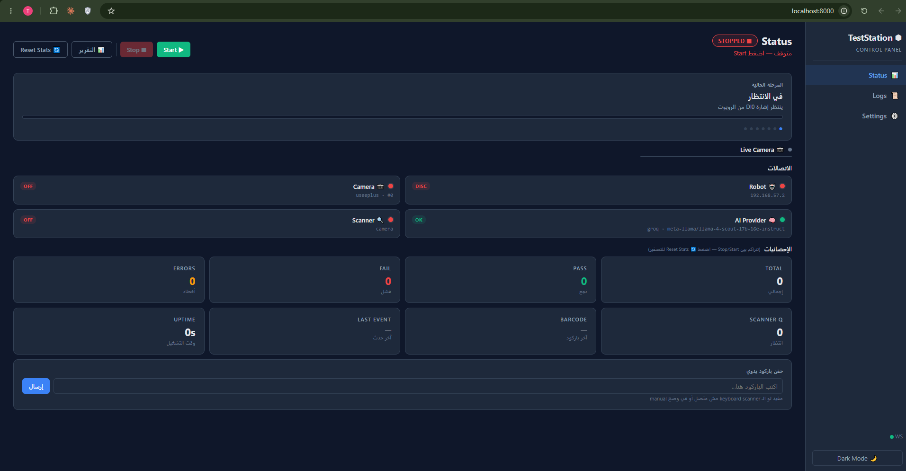
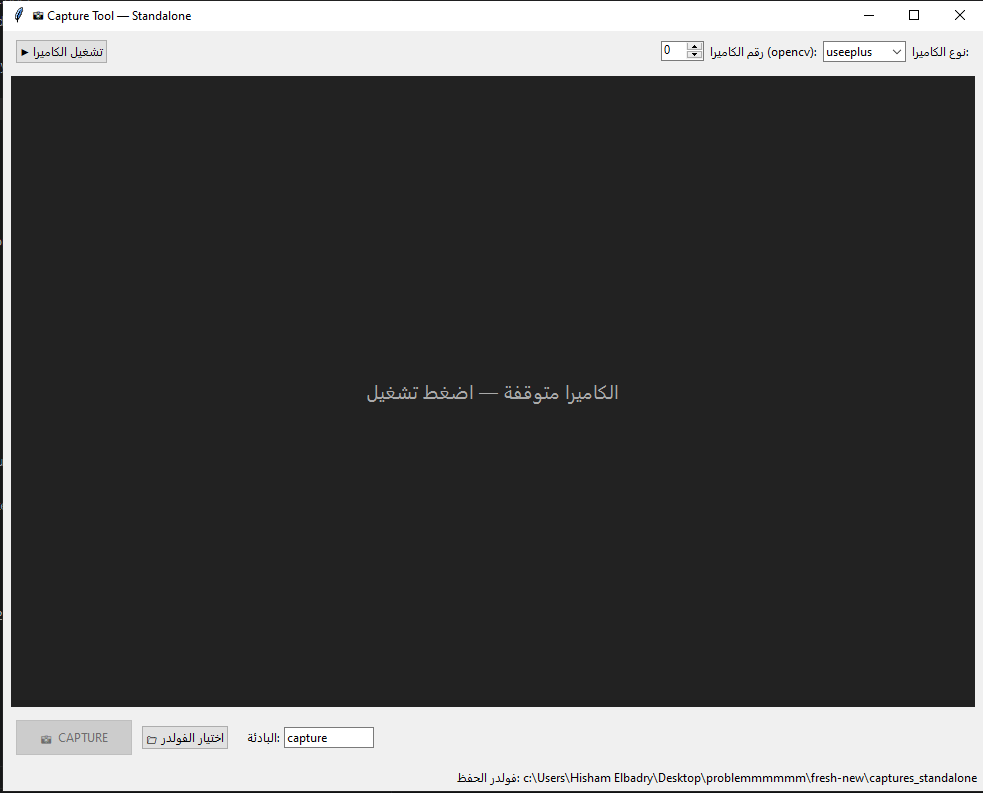

<div align="center">

# 💧 Water Inspection Test Station

**AI-powered automated water-leak inspection station**
Fairino cobot · UseePlus endoscope camera · AI vision (Gemini / Groq / Local) · Web GUI

[English](#-english) · [العربية](#-العربية)

</div>

---

# 🇬🇧 English

## Overview

An automated factory test station that inspects white-plastic products for **water leaks**. The full cycle is hands-free:

1. The product barcode / QR is scanned (USB scanner or the camera itself).
2. The station looks up the matching robot program from an Excel mapping file.
3. A **Fairino cobot** moves the endoscope camera through a series of inspection points.
4. At every point a photo is taken and sent to an **AI vision model** (Gemini, Groq, or a local LLM) that answers: *water or no water?*
5. A pass/fail verdict is issued (LED / PLC signals), and everything is written to an **Excel report** with the images embedded.
6. Everything is monitored and controlled from a **web GUI** (FastAPI + Socket.IO).

## Architecture

```
                       ┌─────────────────────────────┐
  Barcode scanner ──►  │                             │ ──► Fairino cobot (RPC)
  (USB / camera)       │        ClientsClass         │
                       │      (App state machine)    │ ──► PLC / LED signals
  UseePlus camera ──►  │                             │
  (camera_hub.py)      └──────────┬──────────────────┘
                                  │
                 ┌────────────────┼────────────────────┐
                 ▼                ▼                     ▼
          ai_vision.py       excel.py             web_server.py
       (water detection)  (Excel reports)     (FastAPI + Socket.IO)
        Gemini/Groq/Local                             │
                                                      ▼
                                             static/index.html
                                          (Test Station Controller GUI)
```

## Repository layout

| File / folder | Purpose |
|---|---|
| `web_server.py` | Main entry point — FastAPI + Socket.IO server, serves the GUI on port **8000** |
| `static/index.html` | Web GUI (status, live camera, logs, settings) |
| `ClientsClass.py` | The heart of the station — `App` state machine (barcode → program → vision tests → report) |
| `camera_hub.py` | Unified camera driver — `CameraHub.OpenCV` + `CameraHub.UseePlus` (custom USB protocol parser) |
| `ai_vision.py` | `WaterDetector` — AI providers (Gemini / Groq / Local) + image enhancement + training memory |
| `excel.py` | Excel reports with embedded images (`results_report.xlsx`) |
| `config.py` / `config.json` | Runtime settings, editable from the GUI (password protected) |
| `scanner.py` / `barcode_utils.py` / `camera_barcode.py` | Barcode input: keyboard-wedge scanner or camera (zxing-cpp) |
| `capture_trigger.py` / `live_image.py` | Camera helpers: save-on-trigger, continuous latest-frame writer |
| `fairino/` | Fairino robot SDK (RPC) |
| `setup_points_db.py` / `web_point.db` | Robot inspection points database (SQLite) |
| `thread_logger.py` / `debug_monitor.py` | Thread-safe logging + periodic health snapshots (`logs/`) |
| `capture_app.py` | **Standalone capture tool** — live view + capture button (Tkinter) |
| `live_enhance_tuner.py` | **Live enhancement tuner** — sliders for every parameter, before/after preview |
| `test_glare_enhance.py` | Offline before/after comparison of the enhancement pipeline |
| `histogram_matching/` | Histogram matching module — normalize lighting against a reference image |
| `test_camera_diag.py` | Full camera diagnostic (backend → device → stream) |
| `Dockerfile` / `docker-compose.yml` | Container deployment (image on GHCR) |

## Requirements

**Hardware**
- UseePlus USB endoscope camera (VID `0x2CE3` / PID `0x3828`) — or any OpenCV camera
- Fairino cobot reachable over the network (default `192.168.57.2`)
- USB barcode scanner (optional — camera scanning is supported)

**Software**
- Windows 10/11 (or Linux/Docker), Python **3.12+**
- [Zadig](https://zadig.akeo.ie/) — install the **WinUSB** driver for the UseePlus camera (one time per machine)
- An API key for Gemini (`GENAI_API_KEY`) or Groq (`GROQ_API_KEY`), or a local model (Ollama / LM Studio)

## Installation

```bash
git clone <repo-url>
cd fresh-new
pip install -r requirements.txt
```

1. Plug in the camera and install the WinUSB driver with **Zadig** (Options → List All Devices → select the camera → WinUSB → Install).
2. Create a `.env` file next to the code:
   ```env
   GENAI_API_KEY=your_gemini_key
   GROQ_API_KEY=your_groq_key
   ```
3. Initialize the robot points database (first time only):
   ```bash
   python setup_points_db.py
   ```
4. Verify the camera:
   ```bash
   python test_camera_diag.py
   ```

## Running the main system

**Option A — batch file (recommended on Windows):**
```
start_server.bat        ← adds the firewall rule and starts the server
```

**Option B — manual:**
```bash
python web_server.py
```

**Option C — Docker:**
```bash
docker compose up -d          # GUI on http://localhost:8000
docker compose logs -f
```

Then open **http://localhost:8000** (or the machine IP from any device on the same network).

### The GUI (Test Station Controller)



- **Status page** — component LEDs (Robot / Scanner / Camera / AI), current stage, pass/fail statistics, live camera view, manual barcode injection, Start/Stop buttons, and report download.
- **Logs page** — live log stream with level filter and search.
- **Settings page** — every `config.json` key editable from the browser (password protected, default `admin`).

> Screenshots live in `docs/screenshots/` — see the note there for the recommended shots.

## Companion applications

### 📸 capture_app.py — standalone capture tool

```bash
python capture_app.py
```



Live camera view with a **CAPTURE** button (or Space). Choose the save folder and filename prefix from the UI. Works with UseePlus or any OpenCV camera. *The main server must be stopped first — the camera cannot be opened twice.*

### 🎛️ live_enhance_tuner.py — live enhancement tuning

```bash
python live_enhance_tuner.py                # UseePlus camera
python live_enhance_tuner.py opencv 0      # webcam
python live_enhance_tuner.py image x.jpg   # a still image
```

Before/after preview with a slider for every enhancement parameter (glare compression, gamma, CLAHE, sharpening…). Keys: `Space` freeze frame · `S` save comparison · `C`/`Enter` **confirm** — prints the final parameters ready to paste into your code.

### 🧪 test_glare_enhance.py — offline comparison

```bash
python test_glare_enhance.py                          # all images in captures_standalone/
python test_glare_enhance.py --gamma 1.5 --glare 200  # custom parameters
```

Saves `original | old pipeline | new pipeline` strips into `enhance_compare/`.

### 🌈 histogram_matching/ — lighting normalization

```bash
cd histogram_matching
python histmatch.py --ref good.jpg --src ../captures_standalone --out matched --compare
python histmatch.py --ref good.jpg --save-profile factory_ref.npz   # reusable profile
```

Transfers the brightness distribution of a perfect reference image to any other image (`lab` mode touches luminance only — no color shift). See `histogram_matching/README.md`.

### 📷 camera_hub.py — direct camera test

```bash
python camera_hub.py useeplus 0            # safe init (default, works everywhere)
python camera_hub.py useeplus 0 raw       # native 640×480 without upscale
python camera_hub.py useeplus 0 fullinit  # full app-style init (some hosts dislike it)
```

### 🤖 ai_vision.py — AI detection from the CLI

```bash
python ai_vision.py --run   --provider groq --images img1.jpg img2.jpg --enhance
python ai_vision.py --train --provider gemini --model gemini-2.0-flash --images img1.jpg
```

`--train` mode lets you grade every answer; wrong answers are stored as few-shot examples in the training memory and improve future runs.

## Inspection workflow

```
IDLE → BARCODE_RECEIVED → PROGRAM_LOOKUP → SENDING_PROGRAM
     → VISION_TEST_1 … VISION_TEST_N   (N = vision_test_count, up to 30)
     → REPORTING → DONE
```

Each vision test: the robot moves to the point → a photo is captured → the AI answers Yes/No → any "Yes" (water found) marks the product **FAIL**.

## Key configuration (config.json / GUI Settings)

| Key | Meaning | Default |
|---|---|---|
| `cobot_ip` | Fairino robot IP | `192.168.57.2` |
| `camera_type` | `useeplus` or `opencv` | `useeplus` |
| `scan_mode` | `camera` or `manual` (USB scanner) | `camera` |
| `AI_Agent` / `ai_model` | AI provider and model | `groq` / llama-4-scout |
| `ai_enhancement` | Enhance images before sending to the AI | `false` |
| `vision_test_count` | Number of inspection points | `1` |
| `program_mapping_file` | Barcode → robot program Excel map | `program_mapping.xlsx` |
| `results_report_file` | Output Excel report | `results_report.xlsx` |

## Image enhancement parameters

Set at detector creation (all optional):

```python
detector = WaterDetector.Groq(
    model="...", use_enhancement=True,
    denoise=False,          # heaviest step
    glare_compress=True,    # compress specular reflections on white plastic
    glare_thresh=220,       # brightness treated as glare (lower = more aggressive)
    glare_knee=0.35,        # compression strength (lower = stronger)
    gamma=1.3,              # darken highlights, recover white detail
    clahe_clip=2.0,         # local contrast
    sharpen=1.2,            # 1.0 = off
)
```

Use `live_enhance_tuner.py` to find the best values for your products, then paste them here.

## Troubleshooting

| Symptom | Fix |
|---|---|
| Camera not found | Zadig/WinUSB not installed, or `pip install libusb-package`; run `python test_camera_diag.py` |
| One frame then the stream stops | Use the default safe init (don't pass `fullinit`); try a rear USB2 port, no hubs |
| Distorted frames | Make sure the machine runs the current `camera_hub.py` (search for `MAGIC_WORDS` in the file) |
| Camera busy | Only one process can open it — stop `web_server` before `capture_app` and vice versa |
| GUI doesn't open | Check the firewall rule for port 8000 (`start_server.bat` adds it automatically) |
| `SyntaxError` with `<<<<<<<` | Unresolved Git merge conflict — resolve the markers in the file |

---

# 🇪🇬 العربية

## نظرة عامة

محطة فحص أوتوماتيكية في المصنع بتفحص المنتجات البلاستيكية البيضا بحثاً عن **تسريب مياه**. الدورة كاملة من غير تدخل يدوي:

1. بيتقرا باركود / QR المنتج (سكانر USB أو الكاميرا نفسها).
2. المحطة بتجيب برنامج الروبوت المناسب من ملف Excel للربط.
3. **كوبوت Fairino** بيحرك كاميرا الإندوسكوب على نقاط الفحص واحدة واحدة.
4. عند كل نقطة بتتاخد صورة وتتبعت لـ **موديل AI** (Gemini أو Groq أو موديل محلي) يجاوب: *فيه مايه ولا لأ؟*
5. بيطلع قرار نجاح/فشل (إشارات LED / PLC)، وكل حاجة بتتسجل في **تقرير Excel** بالصور جواه.
6. المتابعة والتحكم كله من **واجهة ويب** (FastAPI + Socket.IO).

## المعمارية

```
                       ┌─────────────────────────────┐
  سكانر الباركود ──►   │                             │ ──► كوبوت Fairino (RPC)
  (USB / كاميرا)       │        ClientsClass         │
                       │      (ماكينة حالات App)     │ ──► إشارات PLC / LED
  كاميرا UseePlus ──►  │                             │
  (camera_hub.py)      └──────────┬──────────────────┘
                                  │
                 ┌────────────────┼────────────────────┐
                 ▼                ▼                     ▼
          ai_vision.py       excel.py             web_server.py
        (كشف المياه AI)    (تقارير Excel)      (FastAPI + Socket.IO)
        Gemini/Groq/Local                             │
                                                      ▼
                                             static/index.html
                                        (واجهة Test Station Controller)
```

## هيكل المشروع

| الملف / الفولدر | الوظيفة |
|---|---|
| `web_server.py` | نقطة التشغيل الرئيسية — سيرفر FastAPI + Socket.IO، بيقدم الواجهة على بورت **8000** |
| `static/index.html` | واجهة الويب (الحالة، الكاميرا لايف، اللوجات، الإعدادات) |
| `ClientsClass.py` | قلب المحطة — ماكينة حالات `App` (باركود ← برنامج ← اختبارات رؤية ← تقرير) |
| `camera_hub.py` | درايفر الكاميرا الموحد — `CameraHub.OpenCV` + `CameraHub.UseePlus` (بارسر USB مخصوص) |
| `ai_vision.py` | `WaterDetector` — مزودي الـ AI (Gemini / Groq / محلي) + تحسين الصور + ذاكرة التدريب |
| `excel.py` | تقارير Excel بالصور المدمجة (`results_report.xlsx`) |
| `config.py` / `config.json` | إعدادات التشغيل، قابلة للتعديل من الواجهة (محمية بباسوورد) |
| `scanner.py` / `barcode_utils.py` / `camera_barcode.py` | قراءة الباركود: سكانر كيبورد أو بالكاميرا (zxing-cpp) |
| `capture_trigger.py` / `live_image.py` | أدوات كاميرا: حفظ صورة عند الطلب، حفظ آخر فريم باستمرار |
| `fairino/` | مكتبة روبوت Fairino الرسمية (RPC) |
| `setup_points_db.py` / `web_point.db` | قاعدة بيانات نقاط الفحص للروبوت (SQLite) |
| `thread_logger.py` / `debug_monitor.py` | لوجينج آمن للثريدز + لقطات حالة دورية (`logs/`) |
| `capture_app.py` | **أداة التقاط مستقلة** — عرض لايف + زرار Capture (واجهة Tkinter) |
| `live_enhance_tuner.py` | **ضبط التحسين لايف** — سلايدر لكل باراميتر مع معاينة قبل/بعد |
| `test_glare_enhance.py` | مقارنة قبل/بعد للتحسين على صور محفوظة |
| `histogram_matching/` | موديول مطابقة الهيستوجرام — توحيد الإضاءة على صورة مرجعية |
| `test_camera_diag.py` | تشخيص كامل للكاميرا (backend ← جهاز ← ستريم) |
| `Dockerfile` / `docker-compose.yml` | التشغيل في كونتينر (الـ image على GHCR) |

## المتطلبات

**هاردوير**
- كاميرا إندوسكوب UseePlus بـ USB (VID `0x2CE3` / PID `0x3828`) — أو أي كاميرا OpenCV
- كوبوت Fairino متوصل على الشبكة (الافتراضي `192.168.57.2`)
- سكانر باركود USB (اختياري — القراءة بالكاميرا مدعومة)

**سوفتوير**
- Windows 10/11 (أو Linux/Docker)، بايثون **3.12+**
- [Zadig](https://zadig.akeo.ie/) — تسطيب درايفر **WinUSB** للكاميرا (مرة واحدة لكل جهاز)
- مفتاح API لـ Gemini (`GENAI_API_KEY`) أو Groq (`GROQ_API_KEY`)، أو موديل محلي (Ollama / LM Studio)

## التثبيت

```bash
git clone <repo-url>
cd fresh-new
pip install -r requirements.txt
```

1. وصّل الكاميرا وسطّب درايفر WinUSB بـ **Zadig** (Options ← List All Devices ← اختار الكاميرا ← WinUSB ← Install).
2. اعمل ملف `.env` جنب الكود:
   ```env
   GENAI_API_KEY=your_gemini_key
   GROQ_API_KEY=your_groq_key
   ```
3. جهّز قاعدة بيانات نقاط الروبوت (أول مرة بس):
   ```bash
   python setup_points_db.py
   ```
4. اتأكد من الكاميرا:
   ```bash
   python test_camera_diag.py
   ```

## تشغيل النظام الرئيسي

**الطريقة أ — ملف الباتش (الأسهل على Windows):**
```
start_server.bat        ← بيضيف قاعدة الفايروول ويشغّل السيرفر
```

**الطريقة ب — يدوي:**
```bash
python web_server.py
```

**الطريقة ج — Docker:**
```bash
docker compose up -d          # الواجهة على http://localhost:8000
docker compose logs -f
```

بعدها افتح **http://localhost:8000** (أو IP الجهاز من أي جهاز على نفس الشبكة).

### واجهة الويب (Test Station Controller)


- **صفحة Status** — لمبات حالة المكونات (روبوت / سكانر / كاميرا / AI)، المرحلة الحالية، إحصائيات النجاح/الفشل، عرض الكاميرا لايف، إدخال باركود يدوي، زراير Start/Stop، وتحميل التقرير.
- **صفحة Logs** — اللوجات لايف مع فلتر مستوى وبحث.
- **صفحة Settings** — كل مفاتيح `config.json` قابلة للتعديل من المتصفح (محمية بباسوورد، الافتراضي `admin`).

> صور الشاشات في فولدر `docs/screenshots/` — فيه ملاحظة هناك باللقطات المقترحة.

## التطبيقات المصاحبة

### 📸 capture_app.py — أداة الالتقاط المستقلة

```bash
python capture_app.py
```


عرض لايف للكاميرا مع زرار **CAPTURE** (أو مسطرة الكيبورد). بتختار فولدر الحفظ وبادئة الاسم من الواجهة. بتشتغل مع UseePlus أو أي كاميرا OpenCV. *لازم توقف السيرفر الرئيسي الأول — الكاميرا مش بتتفتح من برنامجين.*

### 🎛️ live_enhance_tuner.py — ضبط التحسين لايف

```bash
python live_enhance_tuner.py                # كاميرا UseePlus
python live_enhance_tuner.py opencv 0      # ويب كام
python live_enhance_tuner.py image x.jpg   # صورة ثابتة
```

معاينة قبل/بعد مع سلايدر لكل باراميتر (ضغط الـ glare، الجاما، CLAHE، الحدة…). المفاتيح: `Space` تجميد الفريم · `S` حفظ المقارنة · `C`/`Enter` **تأكيد** — بيطبع الباراميترات النهائية جاهزة تتحط في كودك.

### 🧪 test_glare_enhance.py — مقارنة على صور محفوظة

```bash
python test_glare_enhance.py                          # كل صور captures_standalone/
python test_glare_enhance.py --gamma 1.5 --glare 200  # باراميترات مخصوصة
```

بيحفظ شرايط `الأصلية | القديم | الجديد` في `enhance_compare/`.

### 🌈 histogram_matching/ — توحيد الإضاءة

```bash
cd histogram_matching
python histmatch.py --ref good.jpg --src ../captures_standalone --out matched --compare
python histmatch.py --ref good.jpg --save-profile factory_ref.npz   # بروفايل يتستخدم دايماً
```

بينقل توزيع إضاءة صورة مرجعية مثالية لأي صورة تانية (وضع `lab` بيلمس الإضاءة بس — من غير تغيير ألوان). راجع `histogram_matching/README.md`.

### 📷 camera_hub.py — اختبار الكاميرا مباشرة

```bash
python camera_hub.py useeplus 0            # التهيئة الآمنة (الافتراضي — شغالة على كل الأجهزة)
python camera_hub.py useeplus 0 raw       # الدقة الخام 640×480 من غير تكبير
python camera_hub.py useeplus 0 fullinit  # التهيئة الكاملة (بعض الأجهزة مش بتحبها)
```

### 🤖 ai_vision.py — فحص AI من الترمينال

```bash
python ai_vision.py --run   --provider groq --images img1.jpg img2.jpg --enhance
python ai_vision.py --train --provider gemini --model gemini-2.0-flash --images img1.jpg
```

وضع `--train` بيخليك تقيّم كل إجابة؛ الإجابات الغلط بتتخزن كأمثلة few-shot في ذاكرة التدريب وبتحسّن الفحوصات الجاية.

## دورة الفحص

```
IDLE ← BARCODE_RECEIVED ← PROGRAM_LOOKUP ← SENDING_PROGRAM
     ← VISION_TEST_1 … VISION_TEST_N   (N = vision_test_count، حتى 30)
     ← REPORTING ← DONE
```

كل اختبار رؤية: الروبوت بيتحرك للنقطة ← بتتاخد صورة ← الـ AI بيجاوب Yes/No ← أي "Yes" (فيه مايه) بتعمل للمنتج **FAIL**.

## أهم الإعدادات (config.json / صفحة Settings)

| المفتاح | المعنى | الافتراضي |
|---|---|---|
| `cobot_ip` | IP روبوت Fairino | `192.168.57.2` |
| `camera_type` | `useeplus` أو `opencv` | `useeplus` |
| `scan_mode` | `camera` أو `manual` (سكانر USB) | `camera` |
| `AI_Agent` / `ai_model` | مزود الـ AI والموديل | `groq` / llama-4-scout |
| `ai_enhancement` | تحسين الصور قبل إرسالها للـ AI | `false` |
| `vision_test_count` | عدد نقاط الفحص | `1` |
| `program_mapping_file` | ملف Excel لربط الباركود ببرنامج الروبوت | `program_mapping.xlsx` |
| `results_report_file` | تقرير الـ Excel الناتج | `results_report.xlsx` |

## باراميترات تحسين الصور

بتتظبط وانت بتعمل create للـ detector (كلها اختيارية):

```python
detector = WaterDetector.Groq(
    model="...", use_enhancement=True,
    denoise=False,          # أتقل خطوة
    glare_compress=True,    # ضغط انعكاسات الإضاءة على البلاستيك الأبيض
    glare_thresh=220,       # السطوع اللي يعتبر glare (أقل = أقوى)
    glare_knee=0.35,        # قوة الضغط (أقل = أقوى)
    gamma=1.3,              # غمقان الفواتح — بيرجّع تفاصيل البياض
    clahe_clip=2.0,         # الكونتراست المحلي
    sharpen=1.2,            # 1.0 = مقفول
)
```

استخدم `live_enhance_tuner.py` عشان توصل لأحسن قيم لمنتجاتك، وبعدين حطها هنا.

## استكشاف الأخطاء

| العرَض | الحل |
|---|---|
| الكاميرا مش موجودة | Zadig/WinUSB مش متسطب، أو `pip install libusb-package`؛ شغّل `python test_camera_diag.py` |
| فريم واحد وبعدها الستريم بيقف | استخدم التهيئة الآمنة الافتراضية (متبعتش `fullinit`)؛ جرّب منفذ USB2 خلفي من غير hub |
| فريمات مشوهة | اتأكد إن الجهاز شغال بـ `camera_hub.py` الحالي (دوّر على `MAGIC_WORDS` جوه الملف) |
| الكاميرا مشغولة | بتتفتح من برنامج واحد بس — وقّف `web_server` قبل `capture_app` والعكس |
| الواجهة مش بتفتح | اتأكد من قاعدة الفايروول لبورت 8000 (`start_server.bat` بيضيفها تلقائياً) |
| `SyntaxError` فيها `<<<<<<<` | Git merge conflict متساب من غير حل — صلّح الـ markers في الملف |
